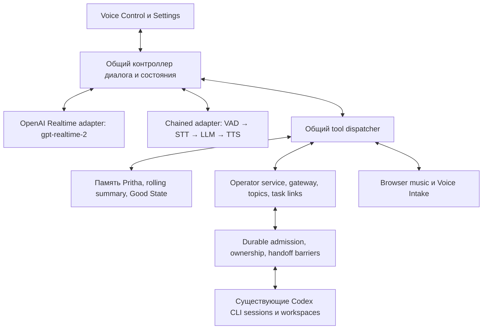

# Второй транспорт Voice Control: исследование и предложение

Исходное исследование: 6 сентября 2026, код `45be624`. Сверка маршрутизации: 8 сентября 2026, **Pritha-NeuralDeep**, код `f1a160c`.
Исследование завершено; выбор модели предварительный, реализации и аудиоизмерений ещё нет.
Pritha/Agents Mother fit: **experiment**.

## Рекомендация

Добавить второй движок диалога `STT → LLM → TTS` за общим интерфейсом Voice Control. Сохранить `gpt-realtime-2` первым вариантом и значением по умолчанию. Карточки, Codex CLI, память, подтверждения и уведомления должны обслуживаться общими модулями.

Для первого работающего прототипа использовать полностью облачный состав: **NeuralDeep Whisper → Qwen3.6 без thinking → NeuralDeep TTS**. Он позволяет проверить перенос поведения с меньшим числом новых runtime-зависимостей. Затем заменить только STT на локальный **Whisper large-v3-turbo через whisper.cpp** и сравнить задержку и точность. Такой гибрид — основной кандидат для регулярной работы на Mac. Локальный **Qwen3-TTS через MLX Audio** подключать следующим этапом, если пройдёт прослушивание и измерение задержки.

Это последовательность проверки, а не три разных реализации Voice Control. У второго транспорта независимо выбираются STT и TTS. Текстовая модель для разговора и модель Codex для выполнения задач имеют отдельные настройки.

## Что проверено

Исходные проверки моделей ниже выполнены 6 сентября. Сверка кода и 48 профильных тестов 8 сентября описаны в следующем разделе; цены, каталог и аудио повторно не проверялись.

- Прочитан код отдельного checkout Pritha-NeuralDeep, его инструкции, документы о контексте и релевантные Good State Baseline. Обычная Pritha использована только для ориентации; её App Server архитектура не предлагается взамен ND CLI.
- Через существующий серверный credential helper выполнены только GET `/v1/models` и `/v1/audio/voices`. Ключ не выводился. Каталог вернул 21 запись, включая обе Qwen-модели и их `-noreason` варианты, GPT-OSS и три STT-модели. Endpoint голосов вернул восемь встроенных голосов.
- Публичные цены и ограничения успешно получены GET-запросами с домена `.ru`, 2026-09-06 в 13:41 UTC. Web-fetch этих JSON и прямое чтение `.tech` не сработали; это не было принято за отсутствие сервиса.
- Модельные inference-запросы, запись/передача микрофона, установка моделей, изменение Settings и запуск сервисов не выполнялись. Наличие модели в каталоге не доказывает успешный inference, качество или задержку.
- В доступной среде Mac — Apple M4 Pro, 64 GiB RAM. Это основание для локального пилота; производительность под одновременной нагрузкой Control Center, Codex и музыкальных моделей не измерена.

## Возможности NeuralDeep

Официальная справка описывает Chat Completions с SSE и tool calling; параметр `user` закрепляет маршрутизацию сессии. Для Qwen предусмотрено отключение thinking. Короткое STT использует `/audio/transcriptions`, SpeechCore — отдельный асинхронный сервис длинных записей. TTS `/audio/speech` описан как синхронная выдача WAV 24 kHz, до 5000 символов. Заявлены десять языков. При `language=Russian` выбирается ESpeech с RUAccent, для остальных — Qwen3-TTS; движок обозначается `X-TTS-Engine`. Квота TTS считается по символам. [Справка NeuralDeep](https://neuraldeep.tech/llms-full.txt).

Важная неопределённость: в живом каталоге у STT стоит `streaming=true`, но контракт непрерывного входящего аудиопотока этим не устанавливается. Нужны проверка endpoint и временная трасса выдачи результатов. Наличие streaming в базовой модели также не означает, что он доступен через конкретный gateway. Первый прототип должен корректно работать с законченными речевыми фрагментами и отдельными TTS-фразами.

## Выбор текстовой модели

| Кандидат | Роль в пилоте | Почему сравнивать | Ограничение вывода |
| --- | --- | --- | --- |
| `qwen3.6-35b-a3b-noreason` | Основной стартовый вариант | Семейство уже используется ND Codex; отдельный быстрый режим разговора; MoE с примерно 3B активных параметров | Работа семейства в Codex не доказывает качество голосового tool loop |
| `qwen3.8-27b-noreason` | Второй участник A/B | Более новая модель; проверить русский диалог, сложные инструкции и выбор инструментов | Dense 27B; более высокая цена не гарантирует полезного выигрыша |
| `gpt-oss-120b`, низкий reasoning effort | Контрольный вариант | Проверить многошаговые tool calls и ответы после ошибок инструментов | Русский язык, скорость и формат служебных полей требуют собственного eval |
| `gpt-oss-20b` | Кандидат при жёстких ограничениях ресурсов/задержки | Есть в живом каталоге | Не принимать снижение точности маршрутизации ради меньшей модели |
| Kimi / Gemma / premium-модели каталога | Расширение после первых результатов | Возможные альтернативы при выявленных проблемах | Нет оснований увеличивать первый пилот до всего каталога |

Первая рекомендация — инженерная гипотеза, а не результат сравнительного теста. Число активных параметров само по себе не определяет latency API. [Qwen3.6 model card](https://huggingface.co/Qwen/Qwen3.6-35B-A3B), [Qwen3.8 model card](https://huggingface.co/Qwen/Qwen3.8-27B).

Начинать с отключённого thinking: голосовой слой должен понимать намерение, пользоваться памятью, выбирать инструмент и объяснять результат. Длительная разработка остаётся в Codex. Не переносить `codexReasoningEffort` в разговорную модель. Передавать только поддерживаемые параметры выбранного провайдера. `reasoning_content` и служебные теги никогда не отправлять в TTS.

Обе Qwen model cards описывают нативное окно 262144 токена, однако фактический лимит gateway проверяется отдельно. Большое окно не является рекомендацией отправлять всю память на каждом ходе. Для пилота ввести измеряемый мягкий бюджет активного контекста, например 8–16k токенов, с сохранением обязательных инструкций и пар tool call/result.

## STT: русский и английский

| Вариант | Где выполнять | Применение | Что проверить |
| --- | --- | --- | --- |
| NeuralDeep `whisper-1` | API | Облачный baseline для RU/EN | Реальная версия весов, язык, словарь терминов, формат загрузки, задержка коротких фраз |
| NeuralDeep `whisper-podlodka-turbo` | API | Отдельный кандидат для русского | Не предполагать качество английского или смешанной речи по названию |
| NeuralDeep `gigaam-v3` | API | Русские команды | Английский и переключение языков требуют отдельного доказательства |
| Whisper `large-v3-turbo` + whisper.cpp | Mac, Metal; Core ML опционально | Рекомендуемый локальный baseline RU/EN | Кодовые имена, короткие ответы, паузы, шум, финализация фрагментов |
| Parakeet TDT 0.6B v3 + MLX Audio | Mac | Конкурент локальному Whisper | Точность терминов, смешанная речь, фактическая реализация streaming |
| Qwen3-ASR 0.6B / 1.7B + MLX Audio | Mac | Следующий эксперимент, если baseline не справляется | Реальный streaming выбранной MLX-версии и стоимость дополнительного runtime |

Whisper turbo — мультиязычный checkpoint примерно 809M параметров. whisper.cpp поддерживает Apple Silicon и локальное выполнение; его подход к живому аудио требует управления окнами и финальными гипотезами в приложении. Не выдавать перекрывающиеся частичные транскрипты за разные команды. [Whisper model card](https://huggingface.co/openai/whisper-large-v3-turbo), [whisper.cpp](https://github.com/ggml-org/whisper.cpp).

Parakeet v3 перечисляет 25 европейских языков, включая русский и английский; лицензия весов — CC BY 4.0. У Qwen3-ASR перечислены 30 языков и 22 китайских диалекта, в том числе RU/EN; лицензия — Apache 2.0. Официальный toolkit Qwen описывает streaming через vLLM: перенос этого свойства на Mac нельзя предполагать автоматически. [Parakeet card](https://huggingface.co/nvidia/parakeet-tdt-0.6b-v3), [Qwen3-ASR card](https://huggingface.co/Qwen/Qwen3-ASR-0.6B).

GigaAM-v3 — небольшое семейство, ориентированное на русскую речь, с несколькими вариантами декодера. Англоязычный тег в каталоге не заменяет проверку требуемого bilingual-сценария. [Первичная карточка GigaAM](https://huggingface.co/ai-sage/GigaAM-v3).

Для RU/EN в одном разговоре нужен режим Auto с закреплением основного языка после достаточной фразы. Короткое «да», «нет», «окей» не должно самопроизвольно переключать язык. Словарь Pritha, Codex, NeuralDeep, Settings, названий проектов и коротких ID помогает STT, но не должен превращаться в принудительную подстановку имени задачи. Распознавание выполняет transcription, а не translation.

## TTS: сначала голос и задержка, затем локальность

| Вариант | Рекомендация | Причина / проверка |
| --- | --- | --- |
| NeuralDeep TTS | Первый прототип и облачный профиль | Прослушать русский ESpeech и английский Qwen; проверить доступные голоса для каждого фактического движка |
| Qwen3-TTS-12Hz-0.6B-CustomVoice + MLX Audio | Основной локальный пилот | Единое семейство для RU/EN; начать с 8bit либо bf16 и измерить first audio |
| Qwen3-TTS-12Hz-1.7B-CustomVoice | Кандидат на более естественную речь | Сравнивать вслепую с 0.6B и API при той же фразе и нагрузке |
| Piper | Лёгкий локальный вариант для ограниченного hardware | Есть RU/EN-голоса; оценить естественность и условия конкретных весов |
| Silero TTS | Дополнительный русский кандидат | Сильный фокус на ударениях; лицензии различаются между семействами |
| ESpeech локально | Возможный отдельный эксперимент для русского | Не установлено, какой точный checkpoint использует NeuralDeep; не считать публичные веса точной копией API |

Qwen3-TTS CustomVoice содержит русскую и английскую поддержку. Наличие стиля и выразительности зависит от размера/варианта; маленькую модель нельзя считать эквивалентом 1.7B. У MLX Audio документированы Qwen TTS и аудиовыдача по частям. Это подтверждает путь интеграции, а не скорость на конкретном Mac. [Qwen3-TTS](https://github.com/QwenLM/Qwen3-TTS), [MLX Audio](https://github.com/Blaizzy/mlx-audio).

Для persona Pritha отдельно подобрать женский голос в каждом движке: имя `marin` не имеет переносимого акустического эквивалента. Сохранить женскую грамматику и уровни Beginner/Advanced/Expert. В слепом тесте проверить ударения, числа, короткие ID, английские названия внутри русского текста, длинные фразы и усталость от голоса за 15 минут.

Для Piper текущий движок опубликован под GPL-3.0, у весов собственные карточки. У Silero большинство моделей имеют некоммерческие условия, часть CIS base — MIT. Публичная ESpeech RL-V2 карточка маркирована Apache 2.0; связь с checkpoint NeuralDeep не подтверждена. Эти различия влияют на выбор распространяемого компонента. [Piper](https://github.com/OHF-Voice/piper1-gpl), [каталог голосов](https://github.com/rhasspy/piper/blob/master/VOICES.md), [Silero](https://github.com/snakers4/silero-models#licence), [ESpeech](https://huggingface.co/ESpeech/ESpeech-TTS-1_RL-V2).

Kokoro не выбирается единым RU/EN-движком: в проверенном списке поддерживаемых языков русского нет. Для первого этапа не требуется voice cloning.

## Стоимость и ограничения

Снимок публичного wallet-прайса на 2026-09-06, RUB за 1M токенов:

| Модель | Вход | Кэшированный вход | Выход |
| --- | ---: | ---: | ---: |
| Qwen3.6-35B-A3B, включая noreason | 7.14 | 0.714 | 40.8 |
| Qwen3.8-27B, включая noreason | 24.48 | 2.448 | 122.4 |
| GPT-OSS-120B | 5.1 | 0.51 | 20.4 |
| GPT-OSS-20B | 3.06 | 0.306 | 14.28 |

STT: Whisper и Podlodka — 1 RUB/мин; GigaAM-v3 — 0.25 RUB/мин. Для строк с `billing=minute` брать `rub_per_min`, не смешивать со служебными token-полями. TTS-тариф в полученном wallet-списке не найден, поэтому полный разговор не оценён. [Публичный прайс](https://neuraldeep.ru/api/public/wallet-prices).

Пример расчёта, не прогноз расхода: один LLM-запрос с 8000 некэшированных входных и 200 выходных токенов стоит около **0.0653 RUB** у Qwen3.6 и **0.2203 RUB** у Qwen3.8. Дополнительные проходы после инструментов, summary и retries считаются отдельно; аудио не включено. Для 20 минут фактически отправленной речи Whisper-STT составит 20 RUB. Минуты открытого разговора и минуты отправленного аудио различаются.

Подписку считать отдельно от wallet. Публичные tier limits показывают ограничения RPM и одновременности: например Free — 20 chat RPM / 3 parallel; Starter — 60 / 16. Это пределы тарифа, а не остаток конкретного аккаунта. [Ограничения тарифов](https://neuraldeep.ru/api/public/tier-limits).

Разговорный LLM и Codex делят ресурсы провайдера. Нужен учёт отдельных коротких запросов голоса и длинных задач. Освобождать lease завершившегося LLM-запроса **до** запуска tools/Codex, чтобы не получить ожидание самим себя при малом parallel limit. Справедливое планирование и приоритет коротких голосовых запросов проектируются поверх текущего admission coordinator; старые task leases и receipts сохраняются.

Локальные STT/TTS убирают соответствующие API-вызовы, но требуют памяти, загрузки моделей, сопровождения и вычислений. Пока LLM находится в NeuralDeep, система не является полностью offline: текст и выбранный контекст передаются провайдеру.

## Изменения плана после маршрутизации Voice / Task Chat — 8 сентября

**Вывод: меняется интеграционный контракт и порядок внедрения, а не выбор STT/LLM/TTS.** Сравнён диапазон `45be624..f1a160c`. В release report указан выпущенный исполняемый commit `a0fb828`; следующий `f1a160c` меняет документацию. Это документальное свидетельство выпуска, а не повторная проверка production runtime в рамках исследования.

### Что уже реализовано и должно использоваться обоими транспортами

| Изменение в текущем коде | Поправка к плану |
| --- | --- |
| `scripts/neuraldeep/coordination-store.mjs`, `codex-chat/admission-coordinator.ts`: durable ownership, receipts, session aliases, coordination schema 3 | Не создавать вторую очередь задач внутри chained runner. Свободный compute slot не означает, что Voice отпустил workflow или native session |
| `codex-chat/voice-operator-service.ts`, `voice-operator-context.ts`: единая обработка ответа, approval и recovery с сохранением решения до исполнения | Общий dispatcher вызывает существующий service. Актуальный `answer_codex_task` требует `task_id`, `operator_request_id`, `topic_generation`, `expected_revision`, `answer`; fallback к «последней ожидающей задаче» удалён |
| `codex-chat/voice-queued-handoff.ts`, `scripts/neuraldeep/handoff-barriers.mjs`, `gateway.ts`: typed continuation за активным Voice workflow | Сохранить отдельные намерения «ответить на вопрос» и «продолжить задачу сообщением». Для второго используются `mode=after_completion` и точный `voiceHandoff`; это не live steer и не ответ на pending question |
| `voice-task-links.ts:enableContinuation`: передача idle темы с проверкой task, topic generation, revision, owner и точной session | Связанные карточки продолжают работать с одной native session. Смена транспорта не выполняет handoff, не объединяет произвольные задачи по похожему тексту и не создаёт другой chat |
| `VoiceOperatorCard.tsx`, `VoiceControlPage.tsx`, обновлённые task snapshots | Оба интерфейса используют один pending request. В общий Voice state необходимо перенести `operatorRequest` и `admissionAttemptId`, а не только title/status/result |
| `pritha-runtime.ts:abortPrithaCodexTask`: точный attempt и проверенное завершение owned runtime | Отдельные команды: interrupt audio, cancel queued input, stop task. Stop передаёт `expected_attempt_id`; поздний callback прежнего транспорта не останавливает новую попытку |
| `scripts/neuraldeep/chat-history-store.mjs`, summary projection/SSE, bounded previews | Использовать существующие историю, ссылки и ограниченные проекции. Не заводить второй долговечный журнал задач и не вставлять полный Task Chat в sticky context |
| `voice-execution-permissions.ts`, execution workspaces/resource claims | Принятые task model/profile/cwd/permissions/attachments/budget сохраняются. Разговорная модель и её Settings не пересоздают execution intent и не расширяют ранее принятые полномочия |

Пути `codex-chat/*` в таблице относятся к `interfaces/control-center/src/lib/codex-chat/`; UI — к соответствующим `src/components/codex/` и `src/components/voice/`. Проверяемые символы предпочтительнее исторических line numbers ниже.

При queued handoff фиксируются предшествующие Voice tasks. Они должны завершиться, а их runtime — подтвердить выход; видимого UI idle недостаточно. Более поздняя Voice задача не должна обгонять зарезервированное typed continuation. Ошибка/неизвестный исход predecessor, смена topic generation или session оставляют ввод сохранённым и требуют recovery. Отмена queued сообщения не отменяет Voice workflow и не отвечает на его вопрос.

При одновременном голосовом и текстовом ответе общий service принимает одно решение для одной revision: одинаковая повторная доставка получает receipt, конфликтующее значение отклоняется. Новый conversational LLM должен уметь сначала выполнить `inspect_codex_task`, затем передать точный контекст вопроса. Идентификаторы берутся из tool result, а не восстанавливаются из текста или summary. Смена transport epoch не меняет operator request revision или task attempt. После reconnect pending requests перечитываются из канонического состояния.

### Что уточнить в архитектуре

Слой нового транспорта заканчивается на существующих domain operations. Схема становится: **Realtime или STT→LLM→TTS → общий Voice controller/dispatcher → существующие operator service, gateway, topics/links, coordination и Codex CLI**. Расположение этих сервисов в каталогах `realtime` и `codex-chat` не делает их отдельными транспортами; сначала достаточно адаптеров к текущим exports, без массового переноса файлов.

Прямой ND Chat Completions для разговорного LLM остаётся предложением новой возможности, отсутствующей в проверенном коде. Это отдельный разговорный inference path в рамках запрошенной альтернативы; исполнение задач сохраняет CLI-only контракт ND. Его нельзя подключить в обход нынешних provider receipts/accounting. Перед реализацией определить request kind и связь session/turn/request с фактическими вызовами, включая known/unknown usage и потерянный ответ. Повтор речи TTS не повторяет task tool. Существующие guards CLI/Responses используются как контракт, но ещё не доказывают защиту нового Chat Completions клиента.

Ограничения краткого provider request, CLI process, logical workflow owner и workspace/resource claims — разные сущности. Завершившийся разговорный LLM освобождает свой request slot до task tools; это не освобождает владельца Codex задачи. Приоритет короткого голоса не обходит handoff barrier. Квоты STT/TTS проверяются отдельно, их нельзя объявить тем же text-generation cap по аналогии.

Память Pritha, sticky и rolling summary концептуально сохраняются. Дополнительно учитывать состояния индекса `ready/missing/busy/unavailable`: обслуживание memory index не должно очищать карточки или обрывать голосовой UI. Ошибка доступа к памяти не означает, что память пуста. Каноническая история задач и её SQLite проекции остаются существующими; разговорный контекст получает ограниченные данные и точные ссылки на актуальные requests.

### Скорректированный порядок и evidence

До подключения микрофона прогнать один transport-neutral text/tool набор для обоих адаптеров: create/status, inspect→answer, одновременные typed/voice ответы, queued handoff за несколькими Voice tasks, failed predecessor, lost ACK, stale revision, reconnect и переключение Settings при pending question. Отдельно проверить, что ответ на вопрос не создаёт задачу, отмена очереди не останавливает predecessor, а barge-in не вызывает task abort. Только после этого добавлять STT/TTS.

8 сентября повторно выполнены шесть изолированных suites: `neuraldeep-queued-chat`, `neuraldeep-voice-operator-service`, `neuraldeep-handoff-barriers`, `neuraldeep-task-chat-voice-invariants`, `neuraldeep-voice-task-links`, `neuraldeep-admission-coordinator`: **48 passed, 0 failed/skipped**. Используются fixture state и fake runner; это проверка текущего кода маршрутизации, не live pilot и не доказательство качества новой модели. В частности подтверждены очередь нескольких typed inputs за Voice, exact-session continuation, недопуск stale context, защита от повторного исполнения и операторские receipts.

Новые межтранспортные тесты, аудиоизмерения и реальное RU/EN качество пока не реализованы. Полные 832 tests, browser и live acceptance из [release report](../docs/neuraldeep-roadmap-release-2026-09-08.md) являются результатами предыдущего цикла, а не этой проверки. Good State сверка повторена: **aligned**. Обновляется только исследование; runtime, Settings и службы не меняются.

## Историческая карта кода на 6 сентября

Пути ниже относительны корню Pritha-NeuralDeep; строки относятся к `45be624`.

| Место | Что существует | Что нужно при добавлении транспорта |
| --- | --- | --- |
| `interfaces/control-center/src/components/voice/usePrithaRealtime.ts:676` | Общий hook: UI, журнал, память, карточки, аудио, WebRTC | Выделять границы небольшими шагами; сохранить внешний React-контракт |
| Тот же файл, `:1545`, `:1585`, `:1614` | Sticky builder, отправка и reset | Общий builder; отдельные сериализаторы для Realtime и текстового LLM |
| Тот же файл, `:1926`, `:2020`, `:2075` | Tools, очередь вызовов и OpenAI events | Общий dispatcher; provider-specific parsing остаётся в адаптере |
| Тот же файл, `:2140` | Start требует OpenAI key, создаёт WebRTC | Readiness и запуск должны зависеть от выбранного voice transport |
| `interfaces/control-center/src/lib/realtime/pritha-runtime.ts:2713`, `:3057` | Tool definitions и инструкции | Один источник schemas и поведения для обоих транспортов |
| Тот же файл, `:3126`, `:3175` | Realtime session config / ephemeral secret | Сохранить действующий OpenAI путь |
| Тот же файл, `:3951`, `:4001` | Normalize/save runtime settings | Добавить отдельный versioned voice-конфиг и обратную совместимость |
| Тот же файл, `:3540`, `:3603`, `:4113` | Rolling summary и session-memory promotion | Вызывать из общих domain events с теми же правилами |
| `interfaces/control-center/src/lib/codex-chat/voice-topic-store.ts` и `voice-topic-routing.ts` | Постоянные topic, subject, generation и session bindings | Смена голосовой модели не изменяет topic/generation |
| `interfaces/control-center/src/lib/codex-chat/voice-task-links.ts` | Связи карточка ↔ Task Chat ↔ CLI session | Переиспользовать links, recovery и receipts |
| `interfaces/control-center/src/lib/codex-chat/admission-coordinator.ts` | Координация запусков | Использовать актуальный durable coordinator и отдельный контракт разговорных запросов из сверки 8 сентября |
| `interfaces/control-center/src/components/voice/useVoiceMusic.ts` | Ducking и browser playback | TTS player должен давать тот же сигнал фактического звучания |
| `interfaces/control-center/src/components/settings/VoiceSettingsSection.tsx` | Persona/голос/sticky settings | Добавить selector транспорта и относящиеся к нему поля |

Особенно важно: `music_control` и `confirm_voice_intake` обрабатываются в браузерном `runToolCall`, остальные инструменты — сервером. Перенос только `/api/realtime/tool` потеряет управление музыкой и незавершённые вложения. Нужен общий dispatcher с browser- и server-execution lanes.

## Предлагаемая архитектура

Это смена движка голосового взаимодействия, а не только сетевого протокола. Chained adapter должен дополнительно реализовать turn taking, цикл инструментов, аудиоочередь и прерывания. Разделение speech-to-speech и chained voice также описано в [официальном руководстве OpenAI](https://developers.openai.com/api/docs/guides/voice-agents).

Предлагаемые новые границы модулей:

- `lib/voice/contracts.ts`: нормализованные события и настройки, без OpenAI-типов.
- `lib/voice/context.ts`, `instructions.ts`, `tools.ts`: общие правила диалога, schemas, context envelope.
- `lib/voice/transports/openai-realtime/`: существующая WebRTC-логика за совместимым интерфейсом.
- `lib/voice/transports/chained/`: STT, chat SSE, tool loop, sentence buffering, TTS.
- `components/voice/useVoiceController.ts`: журнал, карточки, intake, presentation; старый hook может остаться временным compatibility facade.
- `lib/voice/providers/`: отдельные NeuralDeep и local adapters; health/capabilities/version для каждого.

Минимальные операции транспорта: connect, disconnect, setMuted, submitText, updateContext, deliverToolResult, interruptOutput. События: speech start/end, partial/final user text, assistant text, playback start/end, tool request/result, turn completed/cancelled, typed error, usage. У каждого события — session/turn/response IDs, порядковый номер и transport epoch. Epoch соединения не должен совпадать по смыслу с постоянной generation Codex topic.

Для ND chat tools преобразуются из Realtime-формата `{type, name, description, parameters}` в Chat Completions `{type: function, function: {...}}`. Значения schemas не переписываются вручную. Ассистентский `tool_calls` и последующие `role=tool` сообщения сохраняются связанными по call ID. Новые API routes должны использовать текущую границу доступа Control Center.

Обычный голосовой ответ выполняется серверным Chat Completions-клиентом. Он не запускает Codex CLI на каждую реплику. Существующий локальный Responses adapter остаётся на пути задач Codex: его дополнительную буферизацию не следует переносить в разговорный audio loop.

## Как сохранить память и контекст

| Вид состояния | Требуемое поведение обоих транспортов |
| --- | --- |
| Память Pritha: curated knowledge, self-model, child-agent knowledge | Те же `full_pritha_memory` операции, индексы, privacy и write-confirmation правила |
| Рабочий контекст модели в текущем разговоре | Нормализованные реплики, tool calls/results и подтверждённые факты; общий ограниченный session state |
| Sticky context | Текущая сессия, максимум 6 событий / 3 задач / 3500 символов в существующем builder; newest instruction имеет приоритет |
| Reset sticky | Инвалидировать прежний sticky snapshot; не архивировать карточки, не удалять память и не создавать новую CLI session |
| Rolling summary | Один ограниченный summary-only handoff; выдача через `recall_rolling_summary` по запросу продолжения/прошлой сессии; без автоматической вставки на старте |
| Session-memory promotion | Те же триггеры, классификация и private draft назначения; без второго параллельного механизма записи |
| Good State | Тот же узкий `record_good_state_signal` |
| Codex conversation | Каноническая история остаётся в CLI/native storage; сохраняются links и scopes |

Chat Completions требует собирать `messages` на каждом ходе: неизменные инструкции и schemas, актуальный ограниченный контекст, последние реплики, связанные результаты tools. Маршрутизация и KV-cache провайдера не заменяют память приложения. Не подключать ещё один агентный memory runtime поверх памяти Pritha.

Sticky snapshot для нового LLM лучше заменять по revision, а не бесконечно дописывать как новые пользовательские команды. Текст поисковой выдачи, файлов и STT остаётся данными своего источника и не получает приоритет системных инструкций. Незавершённый tool call нельзя обрезать отдельно от результата при compaction.

«Собственную память модели» нельзя перенести как внутренние состояния или аудиолатенты Realtime. Можно перенести явные реплики, результаты действий и summary. При новом транспорте могут измениться интерпретация интонации, голос и формулировки. Требуемая совместимость — сохранение информации и действий; идентичное акустическое поведение не обещается.

Рабочая история голоса остаётся ограниченной текущей сессией; не создавать постоянную копию полного транскрипта Codex или голоса в браузере/общей памяти. Долговечно хранить существующие summary и минимальные receipts операций. Новый формат контекста не меняет retention без отдельного решения.

## Аудиоцикл и прерывания

1. Браузер получает микрофон с существующими gain/noise/echo настройками. AudioWorklet выдаёт PCM с метаданными частоты; ресемплирование в 16 kHz выполняется явно для STT/VAD. Не менять частоту только в заголовке файла.
2. Локальный VAD определяет речь; для старта подойдёт Silero VAD. Он обнаруживает акустическую активность, но не заменяет semantic VAD. Настроить паузу окончания, pre-roll и ручной режим «говорить по нажатию». [Silero VAD](https://github.com/snakers4/silero-vad).
3. В API baseline законченная фраза отправляется на STT как поддерживаемый файл. MediaRecorder fragments не считать самостоятельными WAV-файлами. Частичные STT результаты допустимы в UI, но tools выполняются только после final transcript.
4. LLM получает контекст и инструменты. SSE parser собирает разорванные text/tool deltas, проверяет JSON и schema. Неполные аргументы не выполняются. Ошибки не превращаются в пустые разрешённые аргументы.
5. Для речи накапливается короткая законченная фраза. Нельзя отправлять в TTS каждый токен. В HTTP TTS допускается последовательность отдельных фраз: это streaming на уровне приложения, а не доказанный streaming inference API.
6. Player хранит ограниченную очередь, поддерживает backpressure и сообщает реально воспроизведённые сегменты. Фаза speaking и ducking привязаны к звучанию, а не к первому text delta.
7. При новой речи немедленно останавливается локальный playback, очищается очередь, отменяются относящиеся к ответу LLM/TTS-запросы, увеличивается epoch. Запоздавшие события старого ответа игнорируются.
8. Уже запущенная Codex task от прерывания речи не отменяется. Её результат остаётся фактом; отмена задачи — отдельное действие. При неизвестном исходе dispatch сначала проверяется receipt.

Сгенерированное и услышанное — разные состояния. Если человек перебил середину ответа, в следующем контексте отметить, какие сегменты были проиграны и какой ответ прерван. Не утверждать, что пользователь услышал невоспроизведённую инструкцию. Факты выполненных tools сохраняются независимо от playback.

Дубликаты защищаются минимум ключом instance/session/turn/tool-operation с durable receipt для действий. Новый call ID после retry не должен повторно создавать ту же задачу. Существующие admission locks, clientMessageId и task receipts участвуют в сверке. После сетевой неопределённости проверка результата предшествует повторной мутации.

Для server → browser подойдут SSE-события и обычные защищённые POST для команд/фраз. WebSocket имеет смысл при подтверждённом непрерывном STT или PCM streaming; его необходимость проверяется в пилоте. На телефоне «локально» означает выполнение на Mac с Control Center, а не на телефоне: сетевой участок телефон → Mac сохраняется. Audio worker не должен публиковать отдельный незащищённый порт.

## Settings и переключение

Сохранить существующие общие behavior/sticky/mic/music настройки. Добавить выбор **Voice transport**:

- **OpenAI Realtime — gpt-realtime-2**: прежний голос и конфигурация.
- **STT → LLM → TTS**: профили «NeuralDeep API», «Local STT + NeuralDeep», «Local speech + NeuralDeep LLM».

В расширенных настройках второго режима: STT provider/model/language, отдельный conversational LLM и его thinking policy, TTS provider/model/voice/language, turn-taking режим. Фиксировать отдельные настройки обоих транспортов. Отсутствующее поле в старом JSON означает Realtime; неизвестное новое значение при Save даёт понятную ошибку.

`deepTaskPrimaryTransport` продолжает означать Codex transport и остаётся `codex-cli`. Переключатель голоса не меняет Codex model, Keychain profile, state root, topic ID, generation, task card ID или pending approvals. Режим диктовки Task Chat также не привязывается к новому переключателю автоматически.

Для v1 рекомендовано применение выбора **со следующего подключения**, с явной надписью в Settings. Текущий разговор и текущие Codex tasks продолжаются. Если нужен перенос активного разговора, отдельный этап: остановка на границе хода, checkpoint явного контекста, новый transport epoch, восстановление подтверждённых состояний. Сам факт смены транспорта не должен выполнять `thread_reset`.

Readiness зависит от выбранного профиля: в chained режиме отсутствие OpenAI key не блокирует старт. Диагностика различает отсутствие ND credentials, недоступность модели/worker, неподдерживаемый язык, исчерпанную квоту и временную сетевую ошибку. Старый Realtime сохраняет собственную проверку ключа. Секреты остаются на сервере в текущем credential boundary.

При сбое не переключать провайдера молча. Сохранить текст/черновик и показать доступный способ продолжения; автоматический fallback возможен только как заранее выбранная настройка. Повтор TTS не должен повторять LLM/tool action. Failed STT не создаёт команду из пустого текста.

## План внедрения и критерии приёмки

| Этап | Результат | Проверка перед переходом |
| --- | --- | --- |
| 0. Baseline и eval corpus | Контракты после a0fb828, актуальные schemas и измерения Realtime | RU/EN, ownership, operator revisions, queue/handoff, memory, sticky, intake, music |
| 1. Границы модулей | Общие schemas/controller и Realtime adapter | Старый default проходит прежние тесты и операторское демо |
| 2. Text-only chained runner | ND вызывает существующие domain services, provider receipts/accounting интегрированы | Inspect→answer с точной revision, typed/voice race, handoff barrier, lost ACK, stale attempt, без второго scheduler |
| 3. API speech | Завершённый второй транспорт с Settings | STT final → действие → озвученный подтверждённый результат, прерывания |
| 4. Local STT | Whisper baseline и Parakeet challenger | Точность/latency на Mac и с телефона; одновременная нагрузка |
| 5. Local TTS | Qwen 0.6B/1.7B против API | Слепое прослушивание RU/EN, first audio, стабильность streaming |
| 6. Выпуск | Оба транспорта доступны, отдельные настройки сохранены | Staged release, smoke обоих режимов, проверенный rollback |

Для первой модели достаточно 60–100 обезличенных сценариев: примерно поровну RU и EN, дополнительно смешанные фразы и отказные ситуации. Действия проверять на fixtures/synthetic tasks; голосовые образцы для измерения брать с разрешённой записью или подготовленного набора.

Обязательные сценарии:

- Запустить одну задачу, уточнить статус, ответить на вопрос Codex, продолжить ту же карточку; провокация повторного запуска при lost acknowledgement.
- Continue по короткому ID; развилка «новая или прежняя задача»; неоднозначное название; переключение языка между запросом и подтверждением.
- `decision_required`: голос объясняет карточку, а реальный Approve/Reject следует действующему workflow. Не подменять UI approval текстом STT.
- Curated memory retrieval/write; прошлый разговор через recall; чистый старт несвязанной сессии; sticky on/off/reset и новая инструкция поверх старого контекста.
- Intake ещё не отправлен; «что сделать с файлом»; cancel; музыка и плавное ducking; mute и отключение микрофона.
- Перебивание при тексте, TTS, tool call и после создания Codex task; поздний completion старого epoch; ошибка TTS при уже успешном действии.
- 401/403/429/5xx, HTML вместо JSON, worker crash, длинный ответ, пустая/неуверенная транскрипция, reload и повторное подключение.
- Settings туда и обратно; новые настройки не затирают старый голос; активные карточки, scope/generation, memory и ссылки сохраняются.

Измерять WER/CER отдельно от **правильности намерения и tool arguments**: одна потерянная частица «не» опаснее нескольких пунктуационных ошибок. Целевой ориентир пилота — не менее 95% правильных действий на проверочном наборе, ноль дублей/нарушений approval и ноль ошибочных действий на тишине. Указанные числа — критерии пилота, не измеренные показатели моделей.

Latency измерять от **конца речи до реально слышимого первого аудио**, отдельно: endpointing, STT, ожидание квоты, LLM first token, накопление фразы, TTS first audio, playback. Начальные цели для короткой реплики без tools: p50 ≤ 1.5 s, p95 ≤ 3 s; остановка playback после подтверждённого speech start p95 ≤ 200 ms. Для tool-задач отдельно измерять dispatch acknowledgement и сообщение о результате. Цели допускают корректировку после baseline; обещаний такой скорости сейчас нет.

Существующий `lastLatencyMs` выставляется в Realtime при подключении remote audio и не является сопоставимой метрикой ответа на реплику. Новый benchmark не должен сравнивать с этим числом.

Использовать существующие suites `neuraldeep-task-chat-voice-invariants`, `neuraldeep-voice-task-links`, `neuraldeep-admission-coordinator`, `neuraldeep-queued-chat`, `neuraldeep-voice-operator-service`, `neuraldeep-handoff-barriers`, `control-center-rolling-summary`, `control-center-voice-settings`, `control-center-music`, `pritha-voice-control`; добавить поведенческие contract tests обоих адаптеров и fault injection. При реализации нужны typecheck, isolated build, desktop/mobile и strict health страниц/chunks. 6 сентября тесты не запускались; результат шести routing suites от 8 сентября приведён выше.

Миграция additive: существующие `/api/realtime/*` endpoints сохраняются с актуальными request/revision guards, новые поля имеют версию; task/history stores не переписываются ради транспорта. Rollback отключает новый транспорт и возвращает совместимую сборку через текущий release manager, сохраняя новые receipts и пользовательские данные. По release report от 8 сентября rollback floor — `1496520`, coordination schema 3: baseline исследования `45be624` больше нельзя считать безопасной целью отката. Перед будущим выпуском перепроверить фактическую совместимость схем и artifact. Установка локальных сервисов и deployment относятся к этапу реализации с действующим operations workflow.

## Непроверенное и следующее решение

Не установлены: точные STT-веса за provider aliases; внешний streaming-контракт STT/TTS; условия TTS wallet billing; срок обработки и квоты речи конкретного профиля; фактическое качество RU/EN и одновременного STT/TTS на Mac. Каталожные `created` timestamps одинаковы для разных моделей и не используются как даты релизов.

Следующее содержательное решение принимается после text/tool eval и короткого audio benchmark: сохраняем ли Qwen3.6 основным conversational LLM, оправдана ли Qwen3.8, и даёт ли локальный STT измеримый выигрыш. Конечный выбор TTS определяется прослушиванием и задержкой, а не только модельным размером.

## Evidence и связь с прежними решениями

- `docs/realtime.md` подтверждает разделение sticky / rolling summary и чистый старт. Новое предложение **confirms** эти инварианты и **refines** способ подключения транспорта; действующий стандарт не объявляется устаревшим.
- Good State Alignment проверен для Voice Control: найдены релевантные baseline от 2026-08-28 и 2026-07-02. Предложение сохраняет карточки/историю, изоляцию экземпляров, плавное ducking и managed release. Классификация: **aligned**, документирование без изменения поведения.
- Provider metadata/prices: read-only retrieval 2026-09-06, без опубликованной версии API; доступны только текущие snapshots. Нельзя считать capability boolean доказательством сквозного поведения.
- Qwen3.6 и Qwen3.8: точные post-trained model IDs в таблице; Qwen3.8 card содержит August 2026 version context. Конкретные serving revisions ND не предоставлены.
- Qwen3-ASR / Qwen3-TTS: семейства 0.6B/1.7B; [ASR report v2](https://arxiv.org/abs/2601.21337v2) опубликован 2026-01-29, обновлён 2026-01-30; [TTS report v1](https://arxiv.org/abs/2601.15621v1) опубликован 2026-01-22.
- Whisper large-v3-turbo, Parakeet TDT v3, GigaAM v3: проверены перечисленные versioned model cards. Изменения после retrieval и точные weight hashes требуют проверки перед установкой.
- whisper.cpp / MLX Audio / Silero / Piper: прочитана текущая документация; installable commit/package pin и license каждого распространяемого артефакта фиксируются в implementation plan. Код сторонних проектов не устанавливался и не запускался.
- Экспертные углы: Architecture — единые действия и разные adapters; DX — сначала text-only conformance; Product — два понятных режима; Security — прежние credentials/approvals/retention; Evidence — отделение metadata от inference и измерений.
