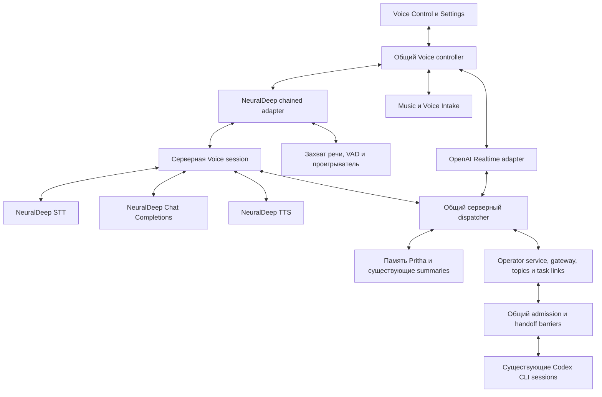

# Кодинг-план: альтернативный Voice Control через NeuralDeep

Состояние реализации и результаты проверок: [отчёт о прототипе](../03_reviews/2026-09-10-neuraldeep-voice-prototype-implementation.md). Прототип реализован как experimental; приёмка на физических Mac/iPhone и управляемый production release остаются отдельными gates. Исходный согласованный план ниже сохранён.

## 1. Результат и зафиксированные решения

Добавить в Pritha-NeuralDeep второй вариант Voice Control:

**микрофон → распознавание речи NeuralDeep → разговорная модель NeuralDeep → существующие инструменты Pritha → синтез речи NeuralDeep.**

Существующий OpenAI Realtime остаётся рабочим первым вариантом и значением по умолчанию. Оба транспорта используют общие карточки, маршрутизацию задач, подтверждения, память и контекст.

План основан на [обновлённом исследовании](../03_reviews/2026-09-06-alternative-voice-transport-research.md) и проверке кода 10 сентября 2026 года. Проверенный Git HEAD — `fe57418`. Во время исследования появилась параллельная незакоммиченная работа над отображением Task Chat; перед реализацией необходимо зафиксировать актуальную исходную точку, сохранив эти изменения.

В рамках подготовки плана прошли **110 профильных тестов**, включая маршрутизацию, operator requests, очередь, память, настройки голоса, музыку, API guard и восстановление процессов. Аудиозадержка и качество новых моделей пока не измерены.

### Состав первого выпуска

| Область | Решение |
|---|---|
| Существующий транспорт | OpenAI Realtime, текущая настройка модели; default `gpt-realtime-2` |
| Новый транспорт | `neuraldeep_chained` |
| STT | NeuralDeep `whisper-1` |
| Разговорный LLM | NeuralDeep `qwen3.6-35b-a3b-noreason` |
| TTS | NeuralDeep `/audio/speech`, начальный голос `serena` |
| Языки | Русский и английский; режимы Auto / Русский / English |
| Переключение | Со следующего подключения |
| Основная приёмка | Mac и настоящий iPhone/Safari |
| Android | Предусмотреть совместимость, реальную приёмку перенести на следующий этап |
| Локальные STT/TTS | Не включать в первый выпуск |
| Обработка речи | Автоматическое определение начала и окончания фразы; возможность перебить озвучку |
| Дополнительный ввод | Сохранить текстовый ввод; добавить ручное завершение записи |
| Автоматическая смена провайдера | Отключена |
| Исполнение задач | Существующий NeuralDeep Codex CLI, без замены транспорта задач |

Read-only запросы 10 сентября подтвердили наличие выбранных STT и LLM в каталоге, а также голоса `serena`. Документация NeuralDeep описывает SSE для Chat Completions и синхронный TTS с WAV 24 kHz. Для русского языка поставщик выбирает ESpeech, для остальных — Qwen3-TTS; фактический движок следует проверять по ответу. Поэтому в первом выпуске потоковая озвучка реализуется последовательностью коротких аудиофрагментов. [Справка NeuralDeep](https://neuraldeep.tech/llms-full.txt).

### Обязательные инварианты

1. Выбор голосового транспорта не изменяет `deepTaskPrimaryTransport`, модель существующей Codex-задачи, её workspace, permissions, budget, topic, generation или native session.
2. Карточки и Task Chat остаются представлениями существующих задач; новый транспорт не создаёт параллельную систему задач.
3. Ответ на вопрос, новое поручение, продолжение через очередь и остановка задачи остаются разными операциями.
4. Повторная доставка одной операции не создаёт второй запуск.
5. Прерывание озвучки не отменяет уже принятую Codex-задачу.
6. Недоступность памяти не трактуется как отсутствие памяти.
7. Смена подключения не очищает существующие задачи, approvals и receipts.
8. Production обновляется только через существующий manager с заранее проверенным откатом.

---

## 2. Архитектура и контракты

### 2.1. Разделение компонентов



**Общий controller** отвечает за интерфейс, карточки, текущие события разговора, sticky context, intake, уведомления и music ducking.

**Транспортный adapter** отвечает за соединение, получение и отправку сообщений, транспортные события и прекращение голосового ответа.

**Серверная chained session** выполняет STT, цикл разговорной модели и инструментов, подготовку TTS и хранит ограниченный контекст активного разговора.

**Существующие domain services** остаются единственным местом исполнения действий над задачами, подтверждениями и памятью.

В первом выпуске всё работает внутри существующего Node/Next.js runtime Control Center. Отдельный постоянно работающий сервер, новый публичный порт и WebSocket-сервис не добавляются.

### 2.2. Совместимость существующего React API

Сохранить экспортируемые `PrithaRealtimeProvider`, `usePrithaRealtime` и текущий контракт потребителей как compatibility façade. Внутри постепенно выделить общий controller и два адаптера.

Сохранить существующие:

- `start`, `stop`, `toggleMute`, `sendTextMessage`;
- управление уровнем микрофона и музыкой;
- загрузку и наблюдение за карточками;
- sticky context, recap и memory promotion;
- фазы `idle`, `connecting`, `listening`, `speaking`, `working`, `error`.

Для нового транспорта добавить отдельное диагностическое поле этапа: `transcribing`, `thinking`, `waiting_for_tool`, `synthesizing`, `waiting_for_provider`. Не менять смысл старых фаз ради отображения внутренних этапов.

Не создавать два одновременно смонтированных controller с собственными polling, обработчиками карточек и музыкой.

### 2.3. Минимальный интерфейс транспорта

```ts
type VoiceTransportId =
  | "openai_realtime"
  | "neuraldeep_chained";

interface VoiceTransport {
  connect(snapshot: VoiceConnectionSnapshot): Promise<void>;
  disconnect(): Promise<void>;
  setMuted(muted: boolean): void;
  submitText(input: VoiceTextInput): Promise<void>;
  updateContext(update: VoiceContextUpdate): Promise<void>;
  deliverBrowserToolResult(result: VoiceBrowserToolResult): Promise<void>;
  interruptOutput(reason: VoiceInterruptReason): Promise<void>;
}
```

Нормализованные события включают:

- готовность подключения;
- начало и окончание речи пользователя;
- окончательный текст пользователя;
- предварительный и окончательный текст ассистента;
- запрос инструмента и его результат;
- готовность аудиофрагмента;
- начало, окончание и прерывание воспроизведения;
- завершение хода;
- изменение состояния задачи;
- ошибку конкретного этапа;
- usage и timing.

Идентификация событий:

- `sessionId`;
- `turnId`;
- `responseId`, когда применимо;
- `sequence`;
- `transportEpoch`;
- `operationId` для инструментов.

`transportEpoch`, `topic_generation`, `operator_request.revision` и `admissionAttemptId` — разные значения. Их нельзя подменять друг другом.

### 2.4. HTTP API новой цепочки

Новые endpoints размещаются под `/api/voice`. Существующие `/api/realtime/*` сохраняются.

| Endpoint | Назначение |
|---|---|
| `GET /api/voice/status` | Конфигурация и readiness выбранного транспорта без inference |
| `POST /api/voice/sessions` | Создать chained session и зафиксировать настройки подключения |
| `GET /api/voice/sessions/{id}/events` | SSE событий с последовательностью и восстановлением подписки |
| `POST /api/voice/sessions/{id}/turns` | Принять текст или законченную аудиофразу с `clientTurnId` |
| `POST /api/voice/sessions/{id}/context` | Обновить контекст с проверкой revision |
| `POST /api/voice/sessions/{id}/browser-results` | Принять результат ожидаемого browser tool |
| `POST /api/voice/sessions/{id}/interrupt` | Прервать конкретный голосовой ответ |
| `GET /api/voice/sessions/{id}/turns/{turnId}` | Проверить принятие и результат хода после потерянного ACK |
| `GET /api/voice/sessions/{id}/audio/{segmentId}` | Получить уже созданное аудио без повторного TTS |
| `DELETE /api/voice/sessions/{id}` | Закрыть голосовую сессию |

Правила API:

- POST хода возвращает подтверждение принятия; исполнение и результат приходят событиями.
- Повторный `clientTurnId` с тем же содержимым возвращает существующий receipt; с другим содержимым — конфликт.
- Возобновление SSE никогда не запускает inference или tools повторно.
- Аудио передаётся бинарно, без base64 внутри SSE.
- Каждый endpoint проходит существующий API guard и проверяет принадлежность Voice session текущему экземпляру и доверенному контексту доступа.
- Клиент не передаёт произвольные provider URL, системные инструкции, credentials или model ID для обхода Settings.
- Результат browser tool принимается только для действительно ожидаемой операции.
- Ответы с пользовательским содержимым и аудио получают `Cache-Control: no-store`.

### 2.5. Хранение состояния

Разделить состояние по сроку жизни:

| Состояние | Где хранить |
|---|---|
| Карточки, topics, native session bindings, approvals | Существующие stores |
| Текущий разговор и незавершённые text/tool сообщения | Ограниченная память серверной Voice session |
| Аудиофрагменты | Временная память; удаление после использования или истечения TTL |
| Receipts ходов и мутаций | Private coordination storage |
| Provider request receipts и timing | Private storage без исходного аудио и полного prompt |
| Usage разговорного LLM | Существующий usage ledger с отдельным source |
| Rolling summary и memory promotion | Существующие механизмы Pritha |

Для первого выпуска:

- SSE replay buffer: максимум 512 событий и 2 MiB на сессию.
- Аудио: максимум три готовых фрагмента и 8 MiB на сессию; TTL 120 секунд.
- Неактивная сессия без исполняющихся операций освобождается через 15 минут.
- Закрытие сессии удаляет её аудио и оперативный контекст.
- Минимальные receipts, необходимые для защиты от повтора, сохраняются.
- Полный голосовой транскрипт не добавляется в постоянный browser storage.

---

## 3. Пошаговая реализация

Каждый пакет заканчивается отдельным проверяемым commit. К следующему пакету переходить только после прохождения его проверок.

### Шаг 0. Зафиксировать исходное состояние и изолировать работу

**Изменения и действия:**

1. Повторно прочитать Git status, HEAD, актуальные инструкции и Good State Baseline.
2. Зафиксировать актуальные изменения Task Chat, включая разделение commentary/final answer и отображение activity.
3. Создать отдельный worktree для реализации от согласованной актуальной исходной точки. Не сбрасывать и не включать автоматически посторонние незакоммиченные изменения.
4. Использовать отдельные fixture state root, Codex home, agent parent и тестовые проекты.
5. Зафиксировать source SHA отдельно от compiled identity работающего Control Center.
6. Подготовить таблицу контрольных сценариев текущего Realtime и маршрутизации.
7. Зафиксировать версии Node, Next.js, React, Playwright и текущие schema versions.

**Проверки:**

- Тесты не используют production state, реальные пользовательские задачи или Keychain по умолчанию.
- Browser harness не подключается к production через `reuseExistingServer`.
- Зафиксированы исходные результаты профильных тестов.
- Известны исходные fingerprints histories, receipts и настроек для последующей приёмки выпуска.

**Критерий завершения:** существует воспроизводимая изолированная среда и исходная точка сравнения.

### Шаг 1. Зафиксировать поведение Realtime тестами

**Изменения:**

1. Добавить characterization fixtures текущих schemas и инструкций для всех трёх behavior profiles.
2. Зафиксировать варианты с включённым и выключенным music tool.
3. Записать синтетические последовательности Realtime events:
   - обычный ответ;
   - вызов инструмента;
   - несколько инструментов;
   - завершение задачи;
   - operator question;
   - disconnect/reconnect;
   - interrupted response.
4. Проверить текущий общий lifecycle provider при переходах между страницами.
5. Зафиксировать корректную обработку `operatorRequest` и `admissionAttemptId` в карточках.

Fixtures должны проверять наблюдаемое поведение и последовательность действий, а не только наличие строк в исходном коде.

**Критерий завершения:** тесты выявляют повторный запуск, потерю карточки, двойное уведомление, потерю tool result и непреднамеренное изменение промпта.

### Шаг 2. Выделить общий Voice controller и адаптер Realtime

Точка входа — текущий [usePrithaRealtime.ts](../interfaces/control-center/src/components/voice/usePrithaRealtime.ts).

**Порядок:**

1. Сначала выделить чистые builders контекста, нормализованные типы и правила формирования событий.
2. Выделить общий обработчик результатов инструментов: карточки, polling, Good State, checkpoints.
3. Вынести WebRTC, data channel и OpenAI event parsing в Realtime adapter.
4. Сохранить существующие функции сборки Realtime configuration и публичные exports.
5. Убрать прямую зависимость sticky/task notifications от открытого OpenAI data channel: отправлять их через интерфейс транспорта.
6. Сохранить один provider на уровне приложения.
7. Не менять существующий Realtime audio path и настройки VAD в этом пакете.

**Проверки:**

- Characterization fixtures совпадают.
- Старый default и существующие environment overrides сохраняются.
- При обычном Realtime подключении не загружаются STT/TTS-клиенты и VAD-модель новой цепочки.
- Переход между страницами не создаёт второй микрофон, polling или аудиопроигрыватель.
- Поведение WebRTC сверяется с официальным контрактом, без перехода на другую модель. [Realtime conversations](https://developers.openai.com/api/docs/guides/realtime-conversations).

**Критерий завершения:** Realtime работает через новый интерфейс без изменения пользовательского поведения.

### Шаг 3. Защитить действия от повторного исполнения

Этот пакет выполняется **до подключения conversational LLM к реальным инструментам**.

**Изменения:**

1. Добавить transport-neutral envelope серверного вызова: session, turn, step, ordinal и operation ID.
2. Получать operation ID из нормализованного хода, а не доверять новому provider call ID после повторной генерации.
3. Перед мутацией сохранять:
   - идентичность операции;
   - hash аргументов;
   - состояние;
   - связанные task/request IDs;
   - подтверждённый результат либо признак неопределённости.
4. Для `run_codex_task` резервировать task ID до побочных эффектов. Передавать его внутренним host context, не добавляя произвольный task ID в LLM tool schema.
5. Повторный вызов с тем же operation ID возвращает существующую задачу или состояние reconciliation.
6. После сбоя между записью request, topic link и admission проверять уже созданные факты. Не создавать другую задачу для «исправления» неизвестного исхода.
7. `answer_codex_task`, approval и recovery продолжают использовать существующий operator service; дополнительный envelope не заменяет его CAS.
8. Валидировать JSON и аргументы общим schema validator. Некорректный JSON не превращать в `{}`.
9. Применять тот же envelope к вызовам обновлённого Realtime adapter, сохраняя совместимость старого endpoint.

**Хранение и совместимость:**

- Добавить receipts операций и HTTP-запросов в существующий private coordination storage.
- Ввести coordination schema **4**, поскольку появляются новый тип исполнения и новые правила восстановления.
- Сохранить history schema и текущие native histories.
- Подготовить compatibility commit, который понимает schema 4, обслуживает прежний Realtime и оставляет chained transport выключенным.
- Именно эта сборка станет будущим rollback artifact после миграции.

**Проверки:**

- Два параллельных вызова создают одну задачу.
- Потерянный ACK после создания карточки не создаёт второй task ID.
- Изменённые аргументы при прежнем operation ID отклоняются.
- Два самостоятельных одинаково сформулированных поручения с разными turn IDs остаются двумя намерениями.
- Сбой на каждой границе записи оставляет восстанавливаемое состояние.
- Старый writer отказывается открывать новую схему.
- Миграция сохраняет counts, identities и содержимое прежних receipts.

**Критерий завершения:** повторная доставка и восстановление не приводят к повторному действию.

### Шаг 4. Подключить разговорные запросы к admission и usage

**Изменения:**

1. Добавить явный тип исполнения `voice_dialogue` для коротких HTTP-запросов разговорного LLM.
2. Использовать тот же coordinator, а не отдельную независимую очередь text inference.
3. Не назначать HTTP-запросу logical owner Codex topic, native session lock или workspace claims.
4. Сохранять provider receipt до отправки запроса.
5. Освобождать lease завершившегося LLM-запроса **до** вызова task tools и ожидания browser tools.
6. Не изменять правила приоритета predecessor и handoff barriers.
7. В первом выпуске не вытеснять работающие CLI и не резервировать постоянно отдельный слот только для голоса.
8. STT/TTS ограничивать отдельно: по одному активному запросу каждого вида на сессию. Их квоты не приравнивать к chat parallel limit.
9. После локальной отмены HTTP сохранять неизвестный usage, если итог не получен. Закрытие клиентского запроса не объявлять доказательством остановки вычисления у провайдера.
10. После перезапуска восстанавливать HTTP receipts по их собственному типу, не передавая их CLI process supervisor.

**Usage:**

- Добавить отдельный source `voice-dialogue`.
- Нормализовать Chat Completions `prompt_tokens`, `completion_tokens`, cached details и total в существующий формат ledger.
- Не смешивать request usage с cumulative CLI usage.
- Запись в ledger выполнять идемпотентно по request ID через сохраняемое accounting event.
- Для STT сохранять длительность отправленного аудио, для TTS — число символов; неизвестную стоимость отображать как неизвестную.
- Не записывать искусственные нулевые токены аудио как «бесплатный запрос».

**Проверки:**

- `parallelLimit=1`: LLM → tool → Codex не блокируют друг друга.
- Несколько CLI и разговорные запросы соблюдают общий chat admission.
- Отмена голоса не снимает чужой owner.
- Replaying accounting event не увеличивает расход.
- Ошибка ledger не приводит к повторному inference.
- Неизвестные usage и стоимость не превращаются в ноль.

**Критерий завершения:** новый разговорный путь имеет собственную идентичность и учёт, сохраняя общий порядок исполнения задач.

### Шаг 5. Реализовать NeuralDeep clients и readiness

**Chat client:**

1. Использовать прямой серверный Chat Completions client на текущем настроенном NeuralDeep origin.
2. Не пропускать разговор через существующий Responses adapter: он буферизует ответ целиком.
3. Использовать текущий Keychain boundary; ключ не попадает в браузер, аргументы CLI, SSE или логи.
4. Использовать pooled HTTP connections через уже установленный `undici`.
5. Читать credential при подключении; не запускать CLI probe на каждую реплику.
6. Использовать фиксированную модель `qwen3.6-35b-a3b-noreason`; не переносить Codex reasoning settings.
7. Передавать стабильный неприватный session routing ID в поддерживаемом поле `user`.
8. Запретить автоматические SDK retries после возможной отправки inference.
9. Отдельно обрабатывать отсутствие видимого ответа, незавершённый stream, превышение лимита и provider error.

**STT client:**

- Принимать корректный WAV с фактической частотой дискретизации.
- Использовать `whisper-1`.
- В Auto не принуждать распознавание к русскому или английскому.
- Дополнительные language/prompt параметры включать только после contract probe конкретного endpoint.
- Пустой или некорректный результат не создаёт LLM turn.

**TTS client:**

- Использовать `serena`, явно выбранный язык и ожидаемый аудиоформат.
- Не принуждать русский запрос к Qwen model ID вопреки provider routing.
- Проверять статус, MIME, корректность WAV и фактический engine header.
- HTML/JSON ошибки не передавать в audio decoder.

**Readiness:**

- Отдельно показывать готовность credentials, LLM, STT и TTS.
- Отсутствие OpenAI key не блокирует chained transport.
- Наличие CLI не является условием простого голосового разговора; недоступность Codex показывается при попытке соответствующего действия.
- Метаданные кэшируются; обычный status не выполняет платный probe.

**Проверки:** fragmented SSE, UTF-8 на границах chunks, `[DONE]`, несколько choices/tool indices, 401/402/403/404/429/5xx, HTML body, пустой ответ, timeout и disconnect.

**Критерий завершения:** все три клиента работают с fixtures; ограниченный live probe подтверждает точный wire contract без запуска пользовательских задач.

### Шаг 6. Реализовать серверную сессию и text-only tool loop

**Порядок:**

1. Реализовать registry сессий, API и SSE.
2. Начать с текстового ввода, без микрофона и TTS.
3. Собирать контекст на сервере из общих инструкций, sticky snapshot, текущего диалога и результатов инструментов.
4. Использовать мягкий бюджет активного контекста 16k токенов по существующему оценщику; фактический usage записывать отдельно.
5. При уменьшении контекста сохранять инструкции, свежий запрос пользователя, точные pending request descriptors и целые пары tool call/result.
6. Не загружать автоматически всю историю Task Chat или всю память Pritha.
7. Выполнять server tools непосредственно через общий dispatcher.
8. Для `music_control` и `confirm_voice_intake` отправлять browser request и ждать подтверждённого результата.
9. Выполнять изменяющие состояние tools последовательно.
10. Ограничить один пользовательский ход восемью LLM-итерациями и шестнадцатью tool calls. При достижении лимита сохранить результаты и остановить цикл с понятным статусом.
11. События завершения задач добавлять как факты, не выдавая их за новое пользовательское поручение.
12. При новом пользовательском ходе прекращать старую генерацию; уже принятую мутацию доводить до receipt независимо от аудио.

**Operator flow:**

- Перед ответом получать актуальный `operator_request` через `inspect_codex_task`.
- Передавать точные `task_id`, `operator_request_id`, `topic_generation`, `expected_revision`.
- При нескольких ожидающих вопросах не выбирать задачу по давности.
- При stale revision обновлять карточку и контекст; не повторять прежний ответ как новый.
- Не создавать `run_codex_task` для ответа на уточнение.

**Проверки:** полный набор маршрутизации из раздела 4, включая одновременные typed/voice ответы и queued handoff.

**Критерий завершения:** текстовый chained runner управляет теми же задачами и карточками, что и Realtime, с теми же правилами подтверждения.

### Шаг 7. Добавить захват аудио, VAD и STT

**Реализация:**

1. Получать микрофон только по действию пользователя.
2. Сохранить существующие echo cancellation, noise suppression, ручной mic gain и выключенный automatic gain control.
3. Подключить Silero VAD через `@ricky0123/vad-web` **0.0.30**.
4. Зафиксировать прямые зависимости и assets в lockfile; начальный кандидат runtime — `onnxruntime-web` **1.29.0**, с отдельным browser compatibility gate.
5. Загружать VAD, ONNX/WASM и worklet с собственного origin, лениво при выборе chained transport.
6. Использовать один поток микрофона. Не позволять библиотеке незаметно создавать второй `getUserMedia`.
7. Полученные 16 kHz samples кодировать в mono PCM16 WAV. Частоту не менять только в заголовке.
8. Отправлять одну окончательную фразу как один turn.

Начальные инженерные настройки:

| Параметр | Значение |
|---|---:|
| Окончание фразы после тишины | 600 ms |
| Pre-roll | 256 ms |
| Минимальная подтверждённая речь | 96 ms |
| Positive threshold | 0.5 |
| Negative threshold | 0.35 |
| Максимум одной записи | 120 секунд |
| Максимум WAV upload | 4 MiB |

Это стартовые настройки реализации, а не доказанные оптимальные значения. Короткие «да» и «нет» входят в обязательную приёмку. Библиотека предоставляет callbacks и 16 kHz audio segments; её интеграцию и освобождение ресурсов необходимо проверить на конкретных браузерах. [VAD API](https://docs.vad.ricky0123.com/user-guide/api/).

**Поведение на границах:**

- При ручном mute/disconnect незавершённая запись не отправляется автоматически.
- При достижении лимита запись сохраняется в текущем интерфейсе до явного отправления или удаления; частичная команда не исполняется.
- Во время STT можно начать новую речь; её нельзя смешивать с другой turn identity.
- Тишина и VAD misfire не вызывают STT.
- При недоступности AudioWorklet показывается доступный ручной режим записи; отсутствие автоматического режима не считается прохождением полной приёмки.

**Критерий завершения:** RU/EN распознавание работает на Mac и iPhone без потери начала фразы, коротких ответов и повторной отправки одного utterance.

### Шаг 8. Добавить TTS, очередь воспроизведения и barge-in

**TTS pipeline:**

1. Разделить текст отображения и текст озвучки.
2. Исключать reasoning, служебные теги, JSON tools, длинные URL и блоки кода из речи.
3. Разбивать ответ по предложениям и безопасным границам фраз.
4. Первый фрагмент стремится к 40–140 символам; последующие — 80–220, максимум 400.
5. Короткие законченные ответы вроде «Да.» отправлять сразу после подтверждения окончательного ответа.
6. Не разрезать числа, короткие task IDs и обычные сокращения.
7. Генерировать следующий фрагмент, пока проигрывается предыдущий; одновременно держать один TTS request и ограниченное число готовых фрагментов.
8. Повторный GET аудиофрагмента не выполняет повторный synthesis.

**Порядок речи и инструментов:**

- Текст из прохода с разрешёнными tools считается предварительным, пока не завершена сборка tool calls.
- Такой текст не озвучивается как подтверждение действия.
- Если проход завершился обычным ответом без tools, его предложения передаются в TTS.
- После подтверждённых результатов tools финальный речевой проход может использовать `tool_choice=none` и выдавать предложения в TTS по мере генерации.
- Не добавлять обязательный дополнительный LLM-запрос к каждому простому ответу.

**Проигрыватель:**

- Использовать существующий пользовательский старт для разблокировки AudioContext на iPhone.
- Фаза `speaking` и ducking начинаются при реальном воспроизведении.
- После последнего фрагмента, ошибки или отмены ducking снимается существующим плавным механизмом.
- Освобождать buffers и object URLs.

**Barge-in:**

1. Подтверждённое начало новой речи немедленно останавливает локальный playback.
2. Очередь старого ответа очищается.
3. Отправляется идемпотентный interrupt.
4. Старые LLM/TTS requests отменяются.
5. Поздние аудиособытия старого epoch игнорируются.
6. Результаты уже исполненных tools сохраняются и обновляют карточки.
7. Новый контекст отмечает, какой ответ прерван и какие целые фрагменты успели прозвучать. Частично проигранное предложение не считается полностью услышанным.

**Критерий завершения:** пользователь может перебить ответ; музыка восстанавливается; ни задача, ни её подтверждённый результат не теряются.

### Шаг 9. Сохранить память, контекст и уведомления

**Изменения:**

1. Подключить существующий `full_pritha_memory` без нового memory runtime.
2. Сохранить текущие пределы sticky: 6 событий, 3 задачи, 3500 символов.
3. Для chained messages заменять sticky snapshot по revision, не накапливая одинаковые обновления.
4. Reset sticky не выполняет `thread_reset` и не удаляет карточки.
5. Rolling summary остаётся summary-only handoff через существующий recall flow.
6. Не вставлять прошлый разговор автоматически при новом подключении.
7. Сохранить прежние triggers session-memory promotion и Good State.
8. Перенести в общие task snapshots `operatorRequest`, `admissionAttemptId`, routing scope и handoff status.
9. Существующие polling/summary updates продолжают работать независимо от состояния аудиотранспорта.
10. После reconnect перечитывать pending requests из канонических stores.
11. `busy/missing/unavailable` у memory index отображать как состояние доступа, сохраняя UI и задачи.

**Критерий завершения:** оба транспорта дают одинаковые результаты по сценариям памяти, sticky, approvals и уведомлений.

### Шаг 10. Добавить Settings и полноценное подключение

**Настройки:**

- `voiceTransport`: `openai_realtime | neuraldeep_chained`.
- Отдельный versioned `neuraldeepVoice` block.
- Начальные поля: language, TTS voice, параметры окончания фразы.
- STT и LLM первого выпуска закреплены выбранным проверенным профилем; произвольный model ID через браузер не принимается.
- Существующие `prithaVoice`, behavior profile, sticky, mic и music settings сохраняются.

**Поведение:**

1. При отсутствии нового поля используется Realtime.
2. Сохранение Settings не переподключает текущую сессию.
3. Интерфейс показывает текущий транспорт и выбор для следующего подключения.
4. `connect` получает неизменяемый snapshot transport settings.
5. Старые Settings requests не удаляют новую вложенную конфигурацию.
6. Отключение chained capability сохраняет его настройки; пользователь явно выбирает Realtime.
7. Переключение не меняет диктовку Task Chat.
8. В production selector становится доступен только после завершения приёмки.
9. На iPhone возврат из фона требует восстановления аудиоконтекста; если браузер остановил запись, UI сообщает об этом и ждёт действия пользователя. Задачи продолжаются.

**Критерий завершения:** оба варианта выбираются и сохраняются, а действующий разговор и задачи не прерываются из-за Save.

### Шаг 11. Полная проверка, настройка скорости и выпуск

1. Выполнить всю матрицу раздела 4.
2. Провести ограниченные реальные RU/EN evals на выбранных моделях.
3. Измерить задержки по этапам и определить фактическое узкое место.
4. Оптимизировать только подтверждённые задержки: повторные probes, лишние копирования, длину контекста, размер TTS-фрагментов и HTTP connection reuse.
5. Не сокращать обязательный контекст и не ослаблять подтверждения ради latency.
6. Подготовить exact candidate commit и совместимый rollback artifact.
7. Выполнить managed rollout по разделу 5.

**Критерий завершения:** выполнены функциональные, скоростные и release gates; Realtime остаётся доступен.

---

## 4. Тесты и критерии приёмки

### 4.1. Матрица обязательных сценариев

| Группа | Сценарии |
|---|---|
| Realtime compatibility | Старый default, настройки голоса, инструменты, музыка, смена страниц, reconnect |
| Создание задач | Один вызов, повторная доставка, потерянный ACK, crash до/после создания request и topic link |
| Operator requests | Inspect → answer, два одновременных ответа, конфликт текста, stale revision, stale generation |
| Handoff | Несколько Voice tasks → typed continuation; поздняя Voice задача не обгоняет barrier |
| Очередь | Cancel queued input не отменяет predecessor; failed predecessor блокирует продолжение |
| Stop | Старый attempt ID не останавливает новую попытку; barge-in не вызывает task abort |
| Recovery | Сначала проверка предыдущего исполнения, затем существующий явный resume/retry; без автоматического replay |
| STT | RU, EN, смешанные названия, «да/нет», отрицания, короткие IDs, шум, тишина, паузы, длинная запись |
| LLM | Fragmented tools, неизвестное имя, invalid JSON, неверные enums, несколько calls, loop limit, пустой ответ |
| TTS | Неверный MIME, пустой WAV, задержка фрагмента, отмена, потеря download ACK, repeated download |
| Прерывания | Во время STT, LLM, ожидания tool, TTS, playback и после принятия задачи |
| Контекст | Sticky on/off/reset, новая инструкция, recall, memory busy, promotion, неполностью услышанный ответ |
| Browser tools | Music control, pending intake, уточнение, cancel, импорт локального аудио |
| Settings | Realtime ↔ chained, отсутствующие старые поля, ошибка сохранения, активная сессия |
| Ресурсы | Limit 1, несколько CLI, две Voice sessions, отсутствие starvation внутри одной темы |
| Доступ | Untrusted host, cross-origin POST, чужая session, spoofed identity, credentials в ошибках |
| Устройства | Mac Chrome/Safari; настоящий iPhone со speaker/headphones, mute, блокировкой и возвратом из фона |
| Долговечность | Restart, corrupted receipt, заполненный replay buffer, повтор accounting event |
| Выпуск | Schema migration, несовместимый writer, rollback с новыми receipts, сохранность историй |

### 4.2. Автоматические проверки

Использовать существующие suites для:

- task-chat/voice invariants;
- queued chat и handoff barriers;
- operator requests/service;
- admission, provider dispatch и usage;
- process supervisor и CLI recovery;
- rolling summary, voice settings, music;
- API guard;
- release state/artifact и storage migration.

Добавить behavioral suites новой цепочки:

- transport conformance;
- voice operation idempotency;
- conversational admission;
- Chat Completions SSE parsing;
- session lifecycle и replay;
- STT upload/validation;
- TTS segmentation/playback;
- interrupt и stale events;
- context assembly;
- dual-transport Settings.

Общие проверки:

- TypeScript;
- соответствующие unit/contract tests после каждого пакета;
- полный applicable self-test перед выпуском;
- Playwright на изолированной сборке;
- validation Markdown и strict privacy;
- `git diff --check`;
- production build и проверка отсутствия private state в build artifacts.

Существующий Playwright config нельзя запускать вслепую против доступного сервера: для этого проекта нужен отдельный изолированный test config с запрещённым reuse production runtime.

### 4.3. Проверка качества моделей

Подготовить 100 обезличенных семантических сценариев:

- 40 русских;
- 40 английских;
- 20 смешанных, неоднозначных и отказных.

Для tool eval использовать fake domain executors: реальная разговорная модель выбирает действия, но не меняет пользовательские проекты.

Обязательные показатели:

- не менее 95% правильного intent и аргументов на всём наборе;
- 100% прохождение критических сценариев: отрицание действия, точная задача, approval, stale context, повтор и отмена;
- ноль повторных запусков;
- ноль обходов подтверждений;
- ноль команд из тишины в подготовленном наборе.

WER/CER измерять отдельно. Они не заменяют проверку смысла команды.

Для речи провести не менее 40 коротких ходов на Mac и 40 на iPhone, поровну RU/EN. Отдельно — 15 минут разговора с паузами, музыкой и несколькими параллельными задачами.

### 4.4. Скорость

Измерять:

- окончание реальной речи;
- решение VAD;
- начало/окончание upload;
- длительность STT;
- ожидание admission;
- первый содержательный LLM delta;
- завершение tool arguments;
- начало/окончание tools;
- время TTS;
- получение и декодирование аудио;
- фактическое начало playback;
- задержку остановки при barge-in.

`lastLatencyMs` текущего подключения Realtime не использовать как метрику ответа на реплику.

**Цели первого выпуска для прогретого соединения и коротких ответов без tools:**

| Метрика | Цель |
|---|---:|
| Конец речи → первый слышимый ответ, p50 | ≤ 1.5 s |
| Конец речи → первый слышимый ответ, p95 | ≤ 3 s |
| Подтверждённое начало перебивания → остановка playback, p95 | ≤ 200 ms |
| Дополнительная задержка приложения после получения готового первого аудио | ≤ 150 ms |
| Ухудшение прежнего Realtime по p95 после общего refactor | Не более 10% и 200 ms |

Холодный старт, provider queue и фоновые ограничения телефона измерять отдельно. Эти числа — критерии, а не обещание текущей производительности API.

Если цепочка функционально исправна, но не проходит скоростной gate, она остаётся экспериментальным вариантом. Нельзя объявлять gate пройденным, исключив медленные успешные запросы, добавив фиктивное «сейчас отвечу» или уменьшив набор проверок.

### 4.5. Ограничение реальных испытаний

В live harness задать явные пределы одного приёмочного цикла:

- до 350 conversational LLM requests;
- до 4 млн входных и 100 тыс. выходных LLM tokens;
- до 10 минут отправленного STT audio;
- до 20 тыс. символов TTS;
- до 10 минут Realtime для сопоставимого контрольного прогона.

Это технические потолки испытания, не утверждение о стоимости. Перед запуском сохранить актуальный billing snapshot. При достижении лимита harness останавливается; повторные прогоны не стартуют автоматически.

---

## 5. Безопасный выпуск и откат

Выпускать только Pritha-NeuralDeep. Не выполнять fleet rollout и не менять материнскую Pritha.

Использовать существующий [workflow staged release](../07_workflows/control-center-staged-release.md).

### Подготовка

1. Получить чистый candidate commit с согласованной параллельной работой Task Chat.
2. Создать compatibility build: schema 4 поддерживается, Realtime работает, chained выключен.
3. Проверить rollback artifact: identity, ancestry, digest и совместимость storage.
4. Включить новые HTTP receipts и Voice sessions в read-only release inspection.
5. Убедиться, что release drain отличает:
   - работающий CLI;
   - активный HTTP-запрос;
   - ожидающий операторский вопрос;
   - неопределённый receipt.
6. Сохранить согласованный private backup SQLite с WAL, native histories, bindings, settings и usage.
7. Проверить candidate на изолированной staged build.

### Установка

1. Сформировать конкретный read-only update plan для exact commit.
2. Выполнить предусмотренное workflow непосредственное согласование lifecycle только после готовности candidate и rollback artifact.
3. Запретить новые dispatch на время управляемого обновления.
4. Дождаться безопасного завершения активной работы; не считать unknown attempt завершённым.
5. Выполнить manager update.
6. Проверить exact compiled identity, страницы и JavaScript chunks.
7. Проверить Realtime первым.
8. Затем включить доступность chained transport, оставляя Realtime default.
9. Выполнить короткий smoke обоих вариантов.
10. Подтвердить работу с настоящего iPhone через существующий доверенный доступ.

### Откат

- Быстрый функциональный откат: выключить доступность chained, сохранив его настройки и receipts.
- Откат сборки: использовать подготовленный compatibility artifact.
- После записи schema 4 не возвращаться к `fe57418`, `45be624` или другой старой сборке, которая её не понимает.
- Не восстанавливать целиком старый snapshot поверх новых задач, histories или usage.
- После отката повторно проверить Realtime, Task Chat и состояние незавершённых задач.

### Итоговый deliverable

Реализация считается законченной, когда:

- оба транспорта доступны в Settings;
- переключение применяется при следующем подключении;
- Realtime проходит прежние сценарии;
- новая цепочка проходит функциональную, модельную и скоростную приёмку;
- карточки, очередь, память и подтверждения используют общие механизмы;
- Mac и настоящий iPhone проверены;
- есть воспроизводимые тесты, timing report и проверенный rollback artifact;
- Android и локальные STT/TTS явно отмечены следующими этапами.

Для локального STT сохранить интерфейс провайдера, позволяющий позднее заменить только распознавание на Whisper через whisper.cpp. Установку моделей, worker lifecycle и локальный TTS выполнять отдельным пакетом после завершения этого выпуска и анализа измерений.
