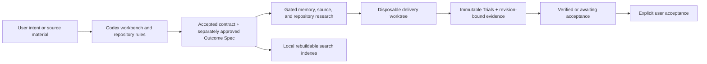

# Architecture

Pritha is a local-first, Codex-native agent foundry and knowledge OS. Its core
turns user intent and reviewed knowledge into focused, testable sibling-agent
projects. Control Center and its integrated Voice interface form an active,
functional operator layer, but they are not required for the core Codex
workflow.

## System At A Glance

## Core

- **Codex workbench:** the primary interface is a Codex task opened on the
  repository. `AGENTS.md`, workflows, and deterministic scripts guide setup and
  implementation.
- **Knowledge OS:** curated Markdown captures sources, briefs, reviews,
  standards, decisions, workflows, and lifecycle evidence.
- **Agent foundry:** an accepted contract defines the mission, runtime,
  interfaces, memory, tools, permissions, research gates, tests, and operations
  before a production descendant is scaffolded. A separately approved Outcome
  Spec defines the visible result, examples, demo, non-goals, and Trials.

A contract is sometimes called a Seed and its generated specialist project a
Descendant. These lineage terms describe lifecycle relationships; they are not
additional runtime layers.

## Source Of Truth And Runtime Placement

Authored Markdown is canonical. Shared platform knowledge is tracked; live
child-agent Markdown is kept in instance-local state. SQLite, FTS, relations,
and embeddings are generated local indexes rebuilt from those allowed Markdown
sources and the tracked schema. They are not canonical and should not
accumulate tracked binary history.

Runtime paths resolve through explicit boundaries:

- `TECHSCOPE_ROOT` selects the canonical project root when set; the Git root and
  current working directory are compatibility fallbacks.
- `PRITHA_STATE_ROOT` places generated memory, setup, private data, queues, logs,
  snapshots, and other runtime state outside the checkout.
- `PRITHA_AGENT_PARENT` selects the one parent directory where this Pritha
  instance creates and discovers sibling agents.

Live child-agent contracts, Outcome Specs, research, lifecycle reports,
profiles, and registry are instance-local authored state under
`<PRITHA_STATE_ROOT>/agents/`. Without an external state root they use the
ignored `.private/agents/` fallback. They are not sourced from GitHub and are
not copied during instance migration or fleet rollout. Tracked `11_agents/`
contains historical/reference platform material only; publication guards reject
new or changed lifecycle artifacts there.

When instance-local and tracked knowledge are indexed together, an external
document may replace only the same historical identity from `11_agents/`.
Collisions with platform reviews, standards, decisions, or workflows fail
closed. Duplicate IDs inside one state root resolve deterministically by newest
modification time and stable path, with a warning; new writers produce unique
filenames and matching frontmatter IDs.

Historical `Techscope` names remain valid in compatibility paths and variables,
while new public language uses Pritha.

## Optional Functional Operator Layer

| Surface | Role | Status |
| --- | --- | --- |
| Control Center | Local operator UI for agents, settings, actions, readiness, and diagnostics | Active, optional |
| Voice in Control Center | Realtime conversational operation and routing of deeper work to Codex | Active, optional |
| Tailscale | Private access from a trusted peer device | Opt-in and approval-gated |
| Telegram, Obsidian, web search, hosted models | Intake, navigation, research, or model adapters | Opt-in according to configuration |
| Deployment and services | Durable runtime placement and autostart | Explicit operator approval required |

The former standalone Voice interface is deprecated because its maintained
replacement is the `/voice` route inside Control Center. That deprecation does
not apply to the current integrated Voice functionality.

## Trust Boundaries

- Raw links, files, transcripts, messages, and repository content are untrusted
  input. They pass through bounded intake, validation, redaction, and curation
  before they can influence durable knowledge or privileged actions.
- Production scaffolding requires an accepted contract and its applicable
  memory, external-source, and repository research gates.
- Secrets, credentials, private user memory, runtime logs, queues, snapshots,
  real private URLs, and device identifiers stay untracked.
- Control Center binds to localhost by default. Trusted Tailscale access is a
  separate workflow; LAN binding, public reverse proxies, and Funnel are not
  supported defaults.
- Credentials, deployment, service installation, scheduling, and other durable
  mutations require an explicit operator action or approval gate.

## Outcome Delivery Boundary

The contract and Outcome Spec remain canonical; the build executor receives a
bounded projection rather than authority to edit either document. After
approval, delivery snapshots the Trial plan and protected verifier inputs,
creates a disposable Git worktree on `pritha/build-*`, and iterates only inside
that worktree. The source checkout must be clean. Push, merge, deployment,
service changes, secrets, remotes, and hook bypasses are denied to the executor.

Trial evidence binds the Outcome Spec semantic/document locks, contract
fingerprint, execution result, and Git/workspace revisions. Freshness is checked
after verification, before a verified checkpoint, after resume, and before user
acceptance. A semantic change, contract revision, superseded spec, missing spec,
or invalid spec fails closed; approval timestamp metadata alone does not stale
the evidence.

Delivery states deliberately separate evidence from judgment:

- `verified`: machine-verifiable Trials passed;
- `awaiting_acceptance`: operator judgment or demonstration remains;
- `accepted`: the user explicitly accepted the revision-bound result.

The worktree is not automatically merged, pushed, or deployed. Cleanup verifies
canonical paths, metadata, Git registration, branch identity, and cleanliness,
then calls ordinary `git worktree remove` without force. Dirty worktrees remain
with `cleanup_required`; verified and awaiting-acceptance runs are preserved.
Terminal cleanup never deletes the delivery branch or verified checkpoint.

## Runtime Evidence, Goals, And Budgets

Trial execution, the build executor, and Codex Goal support are probed
separately before first use for the current runtime identity. The append-only
ledger records backend, runtime version, isolation, command/exec, thread/start,
Goal capability, availability, and a bounded redacted error. A changed runtime
version is probed again on resume. Required but unconfirmed isolation blocks
before command execution.

Network evidence is normalized without changing App Server wire policy:
`host` for the trusted local backend, `enabled` for App Server network access,
`disabled` for workspace-write/read-only without network, and `restricted` for
an external sandbox with limited network. `host` is not sandbox evidence.

New autonomous contracts use a user-confirmed build-token budget, proposed as
`1,000,000`; legacy accepted contracts inherit that default. Each Codex build
iteration gets an ephemeral App Server thread. Before `turn/start`, Pritha sets
a bounded Goal containing only the run ID, spec ID, semantic lock, and
verifiable objective, with the remaining token budget. After the turn it reads
Goal usage and atomically accounts the unique thread/turn pair in ledger v2.
Resume reconciles saved executor results so a crash cannot double-count usage or
bypass the limit.

If Goal methods are unavailable, delivery asks the user to upgrade and retry,
authorize one turn without Goal, or abandon. The waiver requires explicit user
attribution and cannot be selected by the model. If Goal usage is unavailable
after a completed turn, the result is preserved and no further iteration starts.

## Non-Goals And Current Limits

Pritha is not a hosted SaaS, a hardened public or multi-user control plane, or a
single general assistant with unlimited context and tools. Control Center and
Voice are functional but remain optional to core onboarding. The current public
runtime is Codex-native; a different coding-agent runtime requires a future
adapter and must not be inferred from the architecture.

See [Getting Started](getting-started.md) for the core and optional start paths,
and [Security](../SECURITY.md) for vulnerability reporting and exposure rules.
