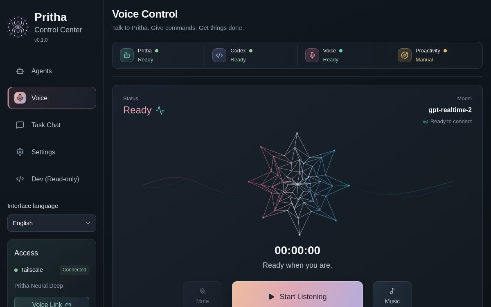

# Pritha Neural Deep — accepted color transfer

## Frozen reference

Preview source commit: `2f9f3d72e93156f447a591a545a0dcf7d3ba6cbb` (version 7).
The reference preview remains unchanged. Its screenshot is preserved below.

## Palette contract

| Role | Color |
| --- | --- |
| Background | #0C1015 |
| Panel | #19222C → #141B23 |
| Primary / secondary / muted text | #F1F4F7 / #BDC7D2 / #94A3B4 |
| Primary action | 110deg, #EFBC9E 0%, #DDA8B8 46%, #B4ADDC 100% |
| Text on primary | #27252F |
| Compact selection | 115deg, #DDBBAD 0%, #D3A3B1 48%, #A7A6CE 100% |
| Link / work | #A1CCC5; detail #75CFC3 |
| Success | #A0C5AE; detail #91CEB1 |
| Warning / decision | #D8C292; detail #E2C078 |
| Voice / selected | #E1B0BB; detail #E7A0B6 |
| Information / context | #B6C2E0; detail #9AAFE0 |
| Error / dangerous action | #E28C91 |
| Star, left to right | #F15380 0%, #EB94AC 30%, #E9ECF3 50%, #67A9EA 72%, #3FCBD7 100% |

Large selected surfaces stay dark. Higher chroma is reserved for small existing
icons, dots, progress fills and contours. Decorative top-edge hairlines are 1px
high and 96px long (144px for the main voice panel), never layout-affecting or
interactive. No glow is added.

## Protected behavior

Only Neural Deep is in scope. Preserve all routes, handlers, provider selection,
credentials, thread history, music ducking, approval gates and private access.
The source working tree contains unrelated Task Chat/settings work; preserve it.
Keep fonts, weights, geometry, responsive rules, animation timing and star mesh.
Use the existing Three.js star and Canvas fallback; change only color output.
Preserve logo, QR colors and user/external images. Leave disabled light mode off.

## Coverage

Shell and mobile navigation; Agents grid/list/detail, lineage and action/credential
panels; Voice and drawers; Task Chat direct/voice groups, Markdown, history and
recovery; all Settings sections including NeuralDeep/Embeddings/Usage; Dev and
Snapshot Operations; links, focus/hover/disabled/loading/empty/error states.

## Verification and release

Use isolated state and a non-production port. Compare the same rendered data with
baseline/current CSS at 1440, 1200, 768, 767, 390 and 320px; retain screenshots and
geometry evidence privately. Target text contrast 4.5:1, large text and meaningful
control contours 3:1. Production remains untouched until visual acceptance and
separate immediate runtime approval. Release only the selected instance through
the staged runtime workflow, with health/chunk checks and rollback.

## Implementation — visually accepted, not released

The operator reviewed the real isolated preview on 2026-09-05 and accepted its
appearance for production Neural Deep. This accepts the palette and its
color-only scope; it does not authorize changes to other Pritha instances or
replace the separate immediate runtime-restart confirmation.

Functional baseline: `88a69c89ae16d21de4d5bd021d4a6f0b5a4599f4`, including
the operator's pre-existing Task Chat/settings edits. These edits have not been
reset, committed or included in the standalone color patch.

| Area | Implementation |
| --- | --- |
| Shared palette | `interfaces/control-center/src/styles/neuraldeep-palette.css`: dark-only semantic text, surface, border, action and detail roles |
| Existing styles | `globals.css`: 265 paint declarations use semantic roles, retaining original light-mode fallbacks; no non-paint declarations changed |
| Shell | `StatusStrip.tsx`: semantic icon-color attributes, independent of position |
| Voice | `VoiceControlPage.tsx`: context/Good State styling hooks only; ink context/session and dark teal Good State surfaces |
| Star | `PrithaStarScene.tsx`: approved five-stop gradient shared by WebGL and Canvas, with sRGB output in Canvas; original topology, thickness, dimensions and motion retained |
| Regression tests | `tests/control-center-palette.test.mjs` and Control Center `tests/e2e/palette.spec.ts` |

The new decorative hairlines are background layers. They cannot intercept
pointer events, introduce a containing block, or affect layout. Compact selected
controls use the quieter selection gradient; selected cards and chat history
rows remain dark. Recording uses the voice role, not the danger role.

## Verification record

- TypeScript check and isolated production build passed. The build emits 23
  dynamic-filesystem tracing warnings in unchanged server code.
- 43 focused unit tests passed, including five new palette tests. Text-role
  contrast is checked against the darkest and lightest intended surfaces;
  primary/selection gradients are sampled between every stop.
- 75 browser geometry comparisons passed: six routes at all six required
  widths, plus agent credentials/loading/action/create-plan panels, focus/hover,
  Voice Link and voice confirmation. Across 38,184 element measurements, no
  font differences or geometry changes exceeding 1px were found.
- Canvas fallback was exercised with WebGL deliberately unavailable, on
  desktop and mobile. Both existing renderers retain the left-rose/right-cyan
  gradient direction.
- A supplemental computed-color audit sampled 1,071 text elements on desktop
  and mobile across six routes, with no failures among eligible samples. It
  composites surface/gradient colors but excludes disabled or reduced-opacity
  controls; this is not an exhaustive accessibility certification.
- Combined browser run: 15 passed, 5 skipped, 1 failed. The final palette-only
  rerun passed all three tests (75 comparisons and two fallback viewports). The failing
  no-console-errors assertion sees an intermittent 503 from
  `/api/settings/neuraldeep-usage` in the isolated build. A direct invocation of
  its local usage-summary command succeeds; the intermittent HTTP failure is
  unresolved and is not attributed to missing credentials.
  An earlier full functional run passed 13 tests with 5 skips. No assertion was
  suppressed to make the final run green.
- Skipped scenarios require alive/managed child runtimes or a priced billing
  provider. Paid inference and live voice sessions were not exercised. Key files
  and production history were not copied to the review build.
- Strict candidate health passed for six pages, the `/codex` redirect and all
  13 referenced JavaScript chunks. Privacy audit and `git diff --check` passed.

### Existing layout limitations, preserved

Baseline/current measurements both show horizontal overflow in Settings at
768px, and on the individual-agent page at 768/390/320px with the synthetic
fixture's long paths. These are not color-transfer regressions. Their correction
would require a separate geometry change, outside this patch.

### Release boundary

During isolation review, the initial candidate was found to inherit the shared
macOS Keychain service name (the status UI reported a configured key). The final
candidate uses a dedicated empty Keychain service, an isolated Codex home and
loopback-only provider/adapter endpoints. These are private review-process
environment settings, not changes to application credentials or API behavior.
The final credential-status endpoint confirms `configured: false`.

Production was not rebuilt, restarted or switched. Its original build identity
remained unchanged and its strict local health/page/chunk check passed. A
separate remote-access check timed out on three pages; trusted-peer access
therefore remains unverified.

The isolated review build is not a deployable production artifact: it is built
against inert test state. After visual acceptance, prepare the agreed source
checkpoint without mixing unrelated working-tree changes into the color patch,
then build a fresh instance-specific staged release through the existing runtime
manager. Obtain separate immediate approval before any production restart.
Keep the displaced build for the workflow's bounded rollback; do not overwrite
history, settings or private state.

### Production preparation after visual acceptance

The runtime manager confirms the intended instance, matching port ownership and
healthy current build. The nine captured candidate files matched their review
hashes before recording this acceptance.

The standard instance updater cannot currently prepare a release: the checkout
contains preserved unfinished edits, and this independent repository has no
`origin/main` release target. Its read-only update plan reports `ok: false`.
Do not reset/stash the working tree, point the fork at another Pritha release,
or bypass the updater's clean-checkout/pinned-release checks.

Production remains unchanged. A separately agreed local staged-release path is
needed before proceeding: immutable source evidence, protected-state checks,
manager-owned stop/start, strict identity/page/chunk verification and a retained
rollback build. No new release mode or service action has been implemented at
this preparation step.

### Local-main consolidation

The operator subsequently approved consolidation of Neural Deep's own local
branches and current edits, with no GitHub publication or changes to other
instances. Both local integration branches were already ancestors of `main`.
Existing Task Chat/settings edits and the accepted palette were preserved in
separate commits. Runtime private files remain untracked.

A pinned `--source local` staged-update mode now provides the required path
without a remote. It retains clean-main, isolation, build, managed lifecycle
and rollback gates and verifies pages, chunks and release identity before
declaring success. Production restart still requires immediate confirmation.
